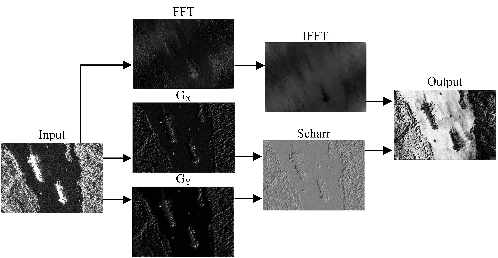

# FSDD: A Frequency–Spatial Decoupled Detector for SAR Ship Detection

> A YOLOv8l-based detector with three novel modules — **FSEM**, **MSFE**, and **SOEP** — for robust ship detection in SAR imagery under complex sea-surface backgrounds and small-target conditions.

<p align="center">
  
</p>

---

## ✨ Overview

Synthetic Aperture Radar (SAR) ship detection is hard: sea-surface clutter, ambiguous small targets, and wide resolution variation. **FSDD** tackles these with three complementary, pluggable modules built on a YOLOv8l baseline (C2f–SPPF backbone → bidirectional PAFPN neck → anchor-free decoupled head at P3–P5):

| Module | Full name | What it does |
|--------|-----------|--------------|
| **FSEM** | Frequency–Spatial Enhancement Module | Fuses a **Scharr-edge spatial branch** with an **FFT-based frequency branch** for dual-domain clutter suppression and edge sharpening. |
| **MSFE** | Multi-Stage Feature Enhancement | **SAPA** (efficient polarized linear attention) + **DyT** (DynamicTanh) + **EDFFN** (edge-enhanced decomposed FFN) + a Mona-style reweighting gate for stage-wise feature recalibration. |
| **SOEP** | Small-Object Enhance Pyramid | **SPDConv** (space-to-depth, no information loss) + **OmniKernel** (SCA + DDFA + FGM) for global–local small-object enhancement. |

## 📁 Repository Structure

```
FSDD-master/
├── FSDD/                        # core package (internally imported as `ultralytics`)
│   ├── cfg/
│   │   ├── models/
│   │   │   ├── COMP.yaml        # full model:  FSEM + MSFE + SOEP
│   │   │   ├── SOEP.yaml        # ablation w/o FSEM
│   │   │   └── MSFE.yaml        # ablation variant
│   │   └── ...                  # default configs
│   ├── nn/
│   │   ├── extra_modules/
│   │   │   ├── block.py         # ← FSEM / MSFE / SOEP implementations
│   │   │   └── __init__.py
│   │   ├── modules/head.py      # RT-DETR decoder (CDN helpers inlined)
│   │   ├── backbone/            # backbones registered in parse_model
│   │   └── tasks.py            # parse_model registration chain (paper modules)
│   └── ...
├── datasets/                    # dataset configs (create image/label data here)
│   ├── SSDD.yaml
│   ├── HRSID.yaml
│   └── RSDD.yaml
├── train.py                     # training entry (COMP.yaml, SSDD by default)
├── val.py                       # evaluation entry
├── detect.py                    # inference entry
├── get_FPS.py / get_model_erf.py / plot_result.py   # paper-side measurement scripts
├── requirements.txt
└── Visualization.jpg            # architecture overview
```

## 📦 Datasets

The model is evaluated on three public SAR ship-detection benchmarks. Prepare each under `datasets/<NAME>/` with an `images/` + `labels/` split (YOLO txt format, single class `ship`, `class=0`).

| Dataset | Sensors | Resolution | Images / Ships | Train / Test | Config |
|---------|---------|------------|----------------|--------------|--------|
| **SSDD** | RADARSAT-2, TerraSAR-X, Sentinel-1 | 1–10 m, multi-pol | 1,160 / 2,456 | 928 / 232 | `datasets/SSDD.yaml` |
| **HRSID** | Sentinel-1B, TerraSAR-X, TanDEM-X | 0.5/1/3 m | 5,604 / 16,951 | 3,642 / 1,962 | `datasets/HRSID.yaml` |
| **RSDD** | Gaofen-3, TerraSAR-X | high-res | 7,000 / 10,263 | 5,000 / 2,000 | `datasets/RSDD.yaml` |

Example layout for SSDD:

```
datasets/SSDD/
├── images/
│   ├── train/   (928 images)
│   └── test/    (232 images)
└── labels/
    ├── train/   (YOLO txt: `class cx cy w h`, normalized)
    └── test/
```

> **Note (RSDD):** the original RSDD provides rotated (OBB) annotations. Convert each OBB to its horizontal outer bounding box before writing YOLO labels, since this is a horizontal-box (HBB) framework.

## 🚀 Installation

```bash
git clone <this-repo-url>
cd FSDD-master
pip install -r requirements.txt
```

> The package directory `FSDD/` is the `ultralytics` source tree for this project (it self-imports as `ultralytics.*`). Make sure the repo root is importable — the entry scripts (`train.py`, `val.py`, `detect.py`) resolve `from ultralytics import RTDETR` against this local package. If you have another `ultralytics` install shadowing it, uninstall it or set `PYTHONPATH=<repo-root>` so the local package takes precedence.

## 🏋️ Training

```bash
# Full model (FSEM + MSFE + SOEP) on SSDD
python train.py
```

`train.py` defaults to `FSDD/cfg/models/COMP.yaml` + `datasets/SSDD.yaml`. To switch dataset or run an ablation, edit the two lines inside `train.py` (or pass them programmatically):

```python
from ultralytics import RTDETR

# Ablation without FSEM
model = RTDETR('FSDD/cfg/models/SOEP.yaml')
model.train(data='datasets/HRSID.yaml', imgsz=640, epochs=600, batch=16, lr0=0.01)
```

**Paper training schedule** (encoded in `train.py`): SGD, `lr0=0.01`, `momentum=0.937`, `weight_decay=5e-4`, 3-epoch linear warmup → cosine annealing to `1e-4`, `batch=16`, `epochs=600`, `seed=42`, EMA, `imgsz=640`. Single-channel SAR is replicated to 3 channels; HSV hue/sat gains are zeroed to preserve SAR statistics.

## 📊 Evaluation & Inference

```bash
# Evaluate on the test split
python val.py            # -> mAP50 / mAP50:95 on datasets/SSDD.yaml

# Run detection on a folder of images
python detect.py         # -> saved under runs/detect/
```

## 🔬 Results

Main results on **HRSID** and **RSDD** test sets (mAP in %, Params in M). Higher is better.

### HRSID

| Method | mAP@50 | mAP@50:95 | Params (M) |
|--------|:------:|:---------:|:----------:|
| RetinaNet | 83.8 | 53.3 | 36.3 |
| Faster R-CNN | 81.0 | 55.9 | 41.3 |
| YOLOv8n | 91.7 | 65.8 | 6.1 |
| **FSDD (Ours)** | **92.7** | **69.3** | 47.1 |

### RSDD

| Method | mAP@50 | mAP@50:95 | Params (M) |
|--------|:------:|:---------:|:----------:|
| RetinaNet | 87.7 | 42.3 | 36.3 |
| Faster R-CNN | 88.6 | 56.2 | 41.3 |
| YOLOv8n | 95.4 | 68.4 | 6.1 |
| **FSDD (Ours)** | **97.1** | **71.5** | 47.1 |

> mAP50:95 is the primary metric (IoU 0.5–0.95). NMS IoU threshold = 0.6, conf threshold = 0.001 during evaluation.

## 📜 Citation

If this work is useful in your research, please cite the paper and this codebase.

```bibtex
@article{fsdd_sar_ship,
  title  = {A Frequency--Spatial Decoupled Detector for SAR Ship Detection},
  author = {{FSDD Authors}},
  note   = {Code available at https://github.com/ZJ-Song-Lab/FSDD}
}
```

## 🙏 Acknowledgements

This repository is based on the [Ultralytics](https://github.com/ultralytics/ultralytics) codebase and the original [ZJ-Song-Lab/FSDD](https://github.com/ZJ-Song-Lab/FSDD). We thank the authors of SSDD, HRSID, and RSDD for providing the public SAR ship-detection datasets.
