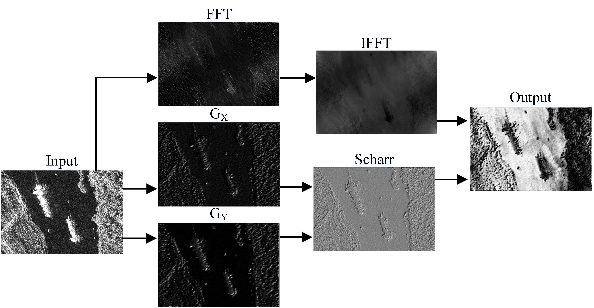

# Dual-Domain Fusion for Small-Object SAR Ship Detection in Complex Scenes


## 📖 Abstract
Synthetic Aperture Radar (SAR) ship detection is a core task in maritime surveillance, but it remains highly challenging due to target scale variations, complex backgrounds, and heavy speckle noise. Existing methods often struggle to detect small vessels in noisy open-sea environments. To address these issues, we propose a novel end-to-end detection framework that integrates **three synergistic modules**:

1. **Frequency–Spatial Enhancement Module (FSEM):** Fuses Scharr-based spatial edge cues with frequency-domain contextual priors, significantly improving robustness against speckle and clutter.
2. **Multi-Stage Feature Enhancement (MSFE):** A lightweight Transformer-inspired block incorporating Polarized Linear Attention, DynamicTanh normalization, and Edge-Enhanced FFNs, enhancing global reasoning and stabilizing training.
3. **Small-Object Enhance Pyramid (SOEP):** Efficiently injects high-resolution details into deeper layers via SPDConv and OmniKernel without adding an extra detection head, improving small-vessel detection with minimal cost.

Extensive experiments on **SSDD**, **RSDD-SAR**, and **HRSID** datasets demonstrate that our framework achieves **state-of-the-art accuracy and efficiency**, particularly for small-object detection in cluttered coastal and open-sea scenarios.

[[Paper PDF](./paper.pdf)] (coming soon)  
[[Project Page](https://github.com/ZJ-Song-Lab/MSEIS_HAFB)]

---

## 🚀 Features
- Robust detection under heavy **speckle noise** and **background clutter**
- Enhanced **multi-scale feature representation** with frequency–spatial priors
- Improved **small-object detection** without overhead of extra detection heads
- State-of-the-art results on **three public SAR ship detection datasets**

---

## 📂 Datasets
We evaluate on three widely-used SAR ship detection datasets:
- **SSDD**: SAR Ship Detection Dataset
- **RSDD-SAR**: Rotated SAR Ship Detection Dataset
- **HRSID**: High-Resolution SAR Ship Detection Dataset

Preprocessing and dataset preparation scripts are available in `./datasets/`.

---

## ⚙️ Installation
```bash
# Clone the repository
git clone https://github.com/ZJ-Song-Lab/FSDD.git
cd FSDD

# Install dependencies
pip install -r requirements.txt
```

---

## 🏋️ Training
```bash
# Example training command
python train.py --data configs/ssdd.yaml --epochs 300 --batch 16 --device 0
```

---

## 🔍 Evaluation
```bash
# Run evaluation
python val.py --data configs/ssdd.yaml --weights runs/train/exp/weights/best.pt
```

---

## 📊 Results
### Main Results (HRSID Dataset)
| Model | mAP@50 | mAP@50:95 | Params (M) |
|-------|--------|-----------|-------------|
| RetinaNet | 83.8 | 53.3 | 36.3 |
| Faster R-CNN | 81.0 | 55.9 | 41.3 |
| YOLO13n | 91.7 | 65.8 | 6.1 |
| **Ours** | **92.7** | **69.3** | 47.1 |

Our framework achieves new **state-of-the-art** performance on multiple benchmarks, particularly excelling in **small-object detection**.

---

## 📸 Visualization
Detection results under **coastal clutter** and **open-sea scenarios**:



---


## 📜 License
This project is released under the **MIT License**. See [LICENSE](./LICENSE) for details.
